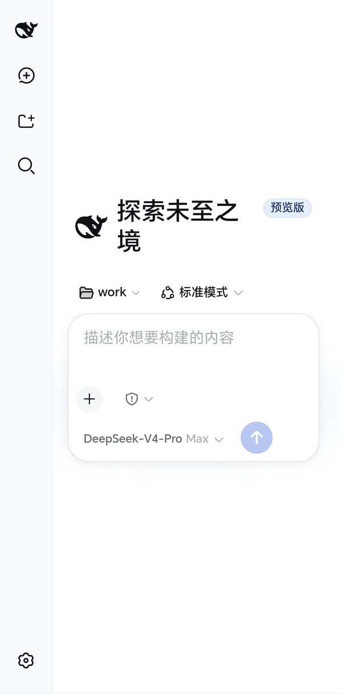
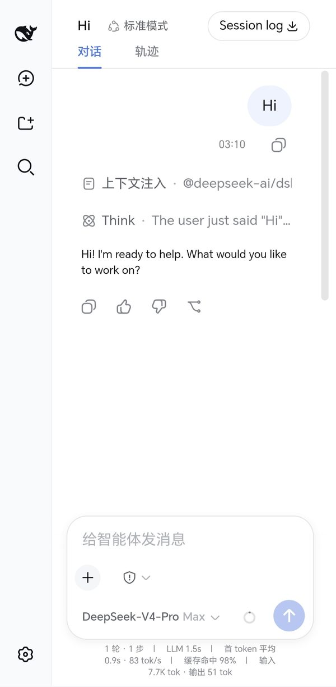

# DeepSeek Harness Remote Deployment

[English](README.en.md) | [中文](README.md)

DeepSeek Harness (dsh) remote deployment package — platform-agnostic; runs on any VPS or server capable of Docker.

> **Target version**: dsh `0.1.0-rc.6` (release-day build, 2026-08-13)
> **Form factor**: nginx edge + dsh backend (three containers: Caddy/nginx/dsh) + persistent volume
> **Verified on**: Zeabur Tokyo node 2C4G (deployment path B)

---


> **Disclaimer**: This is a community project. Not affiliated with, endorsed by, or sponsored by DeepSeek AI. All trademarks belong to their respective owners.

## ⚠️ Security warning (read first)

This package **unlocks dsh's privileged plane** (settings / credentials / model config),
which the official build deliberately locks to loopback until a real authentication layer
exists. By using this package you accept the following:

- **Basic Auth is your ONLY security boundary.** No rate limiting, no audit log, no MFA.
  A weak or leaked password means the attacker gets **agent execution power on your server**
  (shell-equivalent).
- **Anyone who passes auth can modify system configuration and read credential state.**
- **Recommended for personal/self-use only.** For multi-user or production exposure, add
  stronger auth (OAuth2/SSO, IP allowlists, fail2ban) in front of nginx.
- **dsh is in developer preview**; expect breaking changes and unknown vulnerabilities.
  You expose it to the internet at your own risk.

Never bind the dsh backend to a public domain, never use a default password, and never
share the APK if it embeds credentials.

---

> **Core highlight: mobile UI adaptation** — dsh's official frontend is desktop-first and breaks
> badly on narrow screens. This package injects CSS via nginx to deliver 20+ mobile fixes.
> See *Mobile UI adaptation details* below.

## What is this

[dsh](https://github.com/deepseek-ai/deepseek-harness) is DeepSeek AI's open-source agent
harness. The official v1 deliberately leaves deployment hardening (TLS, auth) out of scope,
and locks the privileged plane (settings/credentials/presets) to loopback.

This repository is a **deployment-layer solution** (zero dsh source changes) that provides:

- **Zero source-code changes** — not a single line of dsh code is touched; everything
  lives in the deployment layer (Cordis patches / nginx sub_filter), so upgrading
  upstream never requires re-patching
- **Mobile UI adaptation** (core) — 20+ fixes: vertical settings layout with scrolling,
  popovers avoiding the side rail, composer wrap, font scale, token-line wrapping,
  full-width trajectory chart, locked chat viewport
- Privileged-plane unlock (settings / model config / credentials usable from remote browsers)
- Secure exposure (nginx Basic Auth as the authentication layer dsh is waiting for)
- Performance (gzip, immutable caching, Service Worker offline cache)
- Remote deployment (dsh CLI rejects `--host 0.0.0.0`; solved via the Cordis patch config layer)

## Architecture (platform-agnostic)

```
Phone/Browser ──HTTPS──> TLS terminator (Caddy or platform gateway)
                          │
                          ▼
                  nginx edge (public entry)
                  ├─ Basic Auth (.htpasswd)
                  ├─ gzip / immutable cache / Service Worker
                  ├─ sub_filter: inject mobile CSS + SW registration
                  ├─ sub_filter: rewrite isLoopback (client-side unlock)
                  └─ /api/ rewrites Host/Origin to 127.0.0.1 (server-side unlock)
                          │ internal network (Docker or platform)
                          ▼
                  dsh backend (no public entry)
                  ├─ node:24 + @deepseek-ai/dsh
                  ├─ DSH_HOME=/data/dsh-home (persistent volume)
                  ├─ profile patch: webserver binds 0.0.0.0
                  └─ home patch: trustedHosts allowlist
```

## Directory layout

```
.
├── README.md / README.zh.md
├── docker-compose.yml        # Path A: one-command deployment on any VPS
├── Caddyfile                 # Automatic HTTPS (Let's Encrypt)
├── compat-check.sh           # post-upgrade injection-point health check
├── nginx/
│   ├── default.conf          # nginx edge config (all injection rules)
│   └── sw.js                 # Service Worker (plugin JS local cache)
├── css/
│   └── mobile.css           # mobile adaptation CSS (version-bound, see pitfall #5)
└── dsh/
    ├── startup.sh            # dsh startup script (auto-initializes config)
    ├── cordis.patch.yml      # home-level patch (trustedHosts)
    └── settings.yaml         # server-side settings (model/permission, hot-reload)
```

## Prerequisites

- Any Linux server with Docker (bare metal also works, see below)
- DeepSeek API key
- A domain + DNS record (Caddy auto-issues HTTPS)

## Deployment

### Path A: Docker Compose (any VPS, recommended)

```sh
# 1. Credentials
export DEEPSEEK_API_KEY=sk-xxx
export PUBLIC_DOMAIN=your.domain.com

# 2. Generate the htpasswd file
htpasswd -nb admin <password> > nginx/.htpasswd

# 3. Set your domain in Caddyfile
sed -i 's/YOUR.DOMAIN.COM/your.domain.com/' Caddyfile

# 4. Replace placeholder domains in dsh/cordis.patch.yml

# 5. Start
docker compose up -d
```

Notes:
- The dsh service carries the network alias `dsh.zeabur.internal` so both deployment
  paths share the same `nginx/default.conf`.
- `./dsh` is mounted read-only as the config source; startup.sh initializes the home
  patch and settings on first boot (idempotent).
- Persistent data lives in the `dsh-data` volume; config is code, the repo is the backup.

### Path B: Zeabur (platform-specific)

1. Create a project (region = your server).
2. Service 1: dsh — Prebuilt `node:24`, port 3080/HTTP, volume `/data`,
   Command/Args = contents of `dsh/startup.sh`, env vars `DEEPSEEK_API_KEY` and
   `PUBLIC_DOMAIN`, no public domain.
3. Service 2: nginx — Prebuilt `nginx:1.27-alpine`, port 80/HTTP, write
   `nginx/default.conf` and `nginx/sw.js` via config management, htpasswd to
   `/etc/nginx/.htpasswd`, bind the public domain.
4. Write the home patch and settings.yaml inside the dsh container (or via executeCommand).
5. Restart both services and verify.

> Zeabur specifics: generated domains take a prefix only; the domain MUST be bound to
> the nginx service (see pitfall #3).

## Screenshots






## Mobile UI adaptation details (css/mobile.css)

All fixes below are injected via nginx `sub_filter`; no dsh source code is modified.

| Area | Problem | Fix |
|---|---|---|
| Settings panel | Side-by-side columns crush on narrow screens (content only 127px) | Vertical layout, scrolling nav rail, scrollable content |
| Settings panel | Content overflows and cannot scroll | `max-height:82vh + overflow-y:auto` |
| Settings panel | Nav rail fills the whole panel | Auto-height nav + `flex:1` content |
| Model/context popovers | Covered by the 56px left side rail | Model popover `left:0`; context popover `left:-206px` |
| Composer | Command/model/effort buttons overlap | `flex-wrap`, ellipsis on the model trigger |
| AI reply text | Font too large | 11.5px (tunable) |
| Message meta line (duration/tok/s) | nowrap 361px overflows the screen | Multi-line wrap + 10px |
| Bottom token status bar | 672px content in a 267px container | Multi-line wrap + 9px |
| Chat view | Dragged into horizontal scroll by wide elements | `overflow-x:hidden` |
| Trajectory bar chart | Legend+bars squeeze against the edge, clipped on narrow screens | Legend on its own full-width row |
| Global | 16px base font too large | `html,body` 15px |

> Note: class names are CSS Modules hashes (version-bound). Run `compat-check.sh` after upgrading dsh.

## Pitfalls (important)

1. **node:24-slim build failure**: dsh depends on node-pty (native module); the slim image
   lacks python/gcc. Use the full `node:24` image.
2. **CLI rejects --host 0.0.0.0**: the webserver plugin config layer accepts `0.0.0.0`,
   but the CLI layer intentionally refuses it. Use the profile patch config layer.
3. **(Zeabur only) Generated-domain rules**: `addDomain` takes a prefix only. The domain
   MUST be bound to the **nginx** service; binding it to dsh bypasses auth entirely.
4. **Startup script overwrites the profile patch**: the script rewrites the profile-level
   cordis.patch.yml on every boot. Put cross-restart customizations in the home-level
   `$DSH_HOME/cordis.patch.yml` (applied after the profile layer).
5. **CSS class names are version-bound**: dsh uses CSS Modules; class names embed build
   hashes (e.g. `VOzbGW_panel`) and will likely break after an upgrade. Run `compat-check.sh`,
   then re-locate dead class names by grepping the new version's node_modules.
6. **Privileged-plane loopback lock**: settings/credentials/preset RPCs validate Host/Origin
   against an empty trust list (per the source comment: until a real auth layer exists).
   Fix: nginx rewrites `/api/` Host/Origin to `127.0.0.1:3080` + client-side isLoopback rewrite
   to `true` — valid only because Basic Auth sits in front.
7. **Session export 401**: `/api/session.export` downloads may return 401 in remote
   deployments (unfixed as of rc.6).

## Upgrade guide

1. Run `compat-check.sh` before upgrading (inside the dsh container, pointed at the new node_modules).
2. Dead CSS class names: `grep -r <component-hint> node_modules/@deepseek-ai/dsh-client-*/lib/*.js` in the new version.
3. sub_filter injection point: verify the isLoopback expression in `dsh-client-connection/lib/client.js`.
4. Update the target version in this README.

## Security notes

- Basic Auth is the only authentication boundary: password strength == security strength; no rate limiting.
- Passing auth == having agent execution power (shell-equivalent). Never share the APK or credentials.
- Credentials embedded in an APK are acceptable for personal use only.
- dsh is in developer preview; the team states breaking changes will come.

## Sensitive data

This repository contains no real secrets. Fill in your own during deployment:

- `.htpasswd`: generate with `htpasswd -nb admin <password>`
- `DEEPSEEK_API_KEY`: environment variable
- `trustedHosts`: replace with your own domains

## License

Deployment package: MIT. dsh itself: DeepSeek AI, MIT License.
